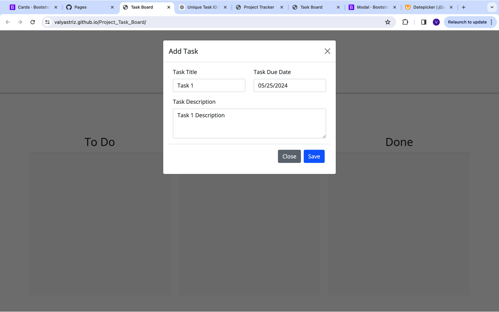

# Task Board

## Description

The Task Board application allows a project team to manage and track project tasks using a dynamic task board. The tasks can be added, updated, moved between different states (Not Yet Started, In Progress, Completed), and deleted. The app runs in the browser and uses dynamically updated HTML and CSS powered by Boostrap, jQuery and the Day.js library for date handling.

## User Story

AS a project team member with multiple tasks to organize  
I WANT a task board  
SO THAT I can add individual project tasks, manage their state of progress, and track overall project progress accordingly

## Acceptance Criteria

GIVEN a task board to manage a project  
WHEN I open the task board  
THEN the list of project tasks is displayed in columns representing the task progress state (Not Yet Started, In Progress, Completed)  
WHEN I view the task board for the project  
THEN each task is color coded to indicate whether it is nearing the deadline (yellow) or is overdue (red)  
WHEN I click on the button to define a new task  
THEN I can enter the title, description, and deadline date for the new task into a modal dialog  
WHEN I click the save button for that task  
THEN the properties for that task are saved in localStorage  
WHEN I drag a task to a different progress column  
THEN the task's progress state is updated accordingly and will stay in the new column after refreshing  
WHEN I click the delete button for a task  
THEN the task is removed from the task board and will not be added back after refreshing  
WHEN I refresh the page  
THEN the saved tasks persist

## Installation

To run the Task Board application locally:

1. Clone the repository:
   ```bash
   git clone https://github.com/valyastriz/Project_Task_Board.git
   ```
2. Navigate to the project directory: 
   ```bash 
   cd Project_Task_Board
   ```
3. Open the index.html file in your preferred web browser.

## Usage
1. Open the application in a web browser.
2. Click the "Add Task" button to open the modal dialog.
3. Enter the task title, description, and deadline date.
4. Click the "Save" button to add the task to the board.
5. Drag and drop tasks between columns to update their progress state.
6. Click the "Delete" button on a task to remove it from the board.

## Screenshots




## Technologies Used

- HTML
- CSS
- JavaScript
- jQuery
- Day.js
- Bootstrap

## Deployment

The application is deployed at the following URL:

## Acknowledgements
Special thanks to ChatGPT for assisting with writing this README

[Deployed Application URL](https://valyastriz.github.io/Project_Task_Board/)

The GitHub repository is available at:

[GitHub Repository](https://github.com/valyastriz/Project_Task_Board.git)
